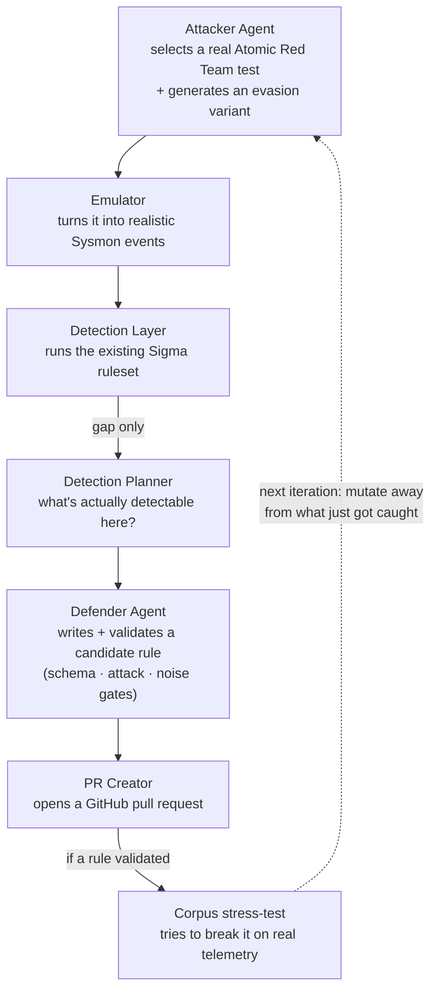

# closed-loop-adversarial-detection


A pipeline that attacks its own detection rules, finds what they miss, and writes new
rules to close the gap — with a human only ever reviewing the final result.

One part of the system emulates a real attacker technique and generates the log
evidence it would produce. Another part checks whether the existing Sigma ruleset
actually catches it. When it doesn't, two more stages work out why and write a
candidate rule — which then has to survive being tested against that same attack
evidence, a pile of ordinary non-malicious activity, and finally real telemetry from
an independent source, before it's presented for review as a pull request.

Full detail on every stage is in [`ARCHITECTURE.md`](ARCHITECTURE.md).

## How it works



**Built with:** Python · Anthropic API (Claude) · pySigma · sqlite3 · FastAPI ·
Terraform · Google Cloud Run · GitHub Actions CI/CD

## Running it

The pipeline runs live on Cloud Run, gated behind a shared secret. 
If you want to actually trigger a run please ask for access.

**Getting a secret:** open an issue, or reach out directly, and ask for read (viewer)
or run access. Viewer access only unlocks read-only status/results endpoints. Run
access actually invokes the LLM pipeline and can open real pull requests against this
repo, so it's shared more selectively.


### Trigger a run

```bash
curl -X POST https://<cloud-run-url>/run \
  -H "X-Pipeline-Run-Secret: <your run secret>" \
  -H "Content-Type: application/json" \
  -d '{
    "technique_ids": ["T1059.001"],
    "max_iterations": 2
  }'
```

Omit `technique_ids` to run whatever's currently configured as default.
`max_iterations` is 1 to 3. Returns immediately (HTTP 202) with a `run_id` — the
pipeline runs in the background, one run at a time. A 409 means a run is already in
progress.

### Check on it

```bash
curl https://<cloud-run-url>/results/<run_id> \
  -H "X-Pipeline-Viewer-Secret: <your viewer secret>"
```

`status` is `"running"`, `"completed"`, or `"failed"`. Once completed, this includes
per-technique coverage, any PR URLs opened, and per-iteration detail. Results persist
across container restarts.

### Quick status check

```bash
curl https://<cloud-run-url>/health \
  -H "X-Pipeline-Viewer-Secret: <your viewer secret>"
```

`status: "ok"` means the service is alive and responding — not a claim that the last
run succeeded or that detection logic is currently sound.

## Documentation

- [`docs/ARCHITECTURE.md`](docs/ARCHITECTURE.md) — full technical reference.

## License

MIT — see [`LICENSE`](LICENSE). A subset of the rules in `rules/` are sourced from or
adapted from [SigmaHQ](https://github.com/SigmaHQ/sigma), which is separately
licensed under the [Detection Rule License (DRL) 1.1](https://github.com/SigmaHQ/Detection-Rule-License) —
those files retain their original `author`/`references` fields as attribution, per
that license's own terms.